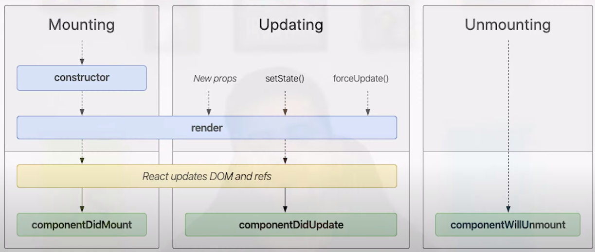

# tutorial-react-toti

Anotações do Tutorial de ReactJS do Guilherme Toti no YouTube.

https://www.youtube.com/watch?v=ghEdUzwRsHo&list=PLe4SO60BV_r0hkjGFaGcmHCtmD5EUzDxM

## Instalação

```
npm install -g create-react-app
create-react-app yt-react
```

ou

```
npx create-react-app 
```


Dentro do JSX

* className - é a forma de usar class de estilo dentro do JSX.


## Componentes

É como se fosse uma função...

```js
class MyButton extends Component {
  render() {
    return <button>Click me</button>
  }
}

class MyLabel extends Component {
  render() {
    return <p>Hello World from Component.</p>
  }
}

class App extends Component {
  render() {
    return (
      <div className="App">
        <MyLabel />
        <MyButton />
      </div>
    );
  }
}
```

### props

props são os parâmetros de entrada do componente.

E o retorno é o JSX.

Os props são passados como atributo do componente.

`text="Olá"`

```js
import React, { Component } from 'react';
import './App.css';

class MyButton extends Component {
  render() {
    return <button>{ this.props.label }</button>
  }
}

class MyLabel extends Component {
  render() {
    return <p>{ this.props.text }</p>
  }
}

class App extends Component {
  render() {
    return (
      <div className="App">
          <header className="App-header">
            <MyLabel text="Olá" />
            <MyButton label="Botão 1" />
            <MyButton label="Botão 2" />
            <MyButton label="Botão 3" />
            <MyButton label="Botão 4" />
          </header>
        </div>
    );
  }
}

export default App;
```


### state

Estado do componente.

```js
class App extends Component {
  constructor(props) {
    super(props);

    this.state = {
      labelText: '',
    };
  }

  setLabelText = (labelText) => {
    this.setState({ labelText });
  }

  ...
}
```

```js
class MyButton extends Component {
  render() {
    return (
      <button
        onClick={() => { this.props.handleClick(this.props.label) }}
      >
        { this.props.label }
      </button>
    )
  }
}
```

```js
<header className="App-header">
  <MyLabel text={this.state.labelText} />
  <MyButton handleClick={this.setLabelText} label="Botão 1" />
  <MyButton handleClick={this.setLabelText} label="Botão 2" />
  <MyButton handleClick={this.setLabelText} label="Botão 3" />
  <MyButton handleClick={this.setLabelText} label="Botão 4" />
</header>
```

* A função `setState` é assíncrona. Então se você precisar esperar pelo resultado dele, use um *callback*.

```js
setLabelText = (labelText) => {
  // this.setState({ labelText });
  this.setState({ labelText }, () => {
    // faça algo
  });
}
```

* Como o `state` é um objeto a função `setState` faz um merge no `state` atual.


## Live Cycle

### Constructor (Created)

* Inicializar o state
* Fazer bind de funções

O bind é um método que define o contexto pra alguma coisa.

* Dentro do Constructor não pode chamar o this.setState()
* Não jogue props para o state. Ele até funciona, mas o constructor só roda na inicialização, então se você mudar o valor da props, o state não vai mudar.


Não é legal usar *arrow function* dentro do constructor, então usamos `bind`.

Antes:

```js
  setLabelText = (labelText) => {
    this.setState({ labelText }, () => {
      // faça algo
    });
  }
```

Depois

```js
constructor(props) {
  super(props);

  this.state = {
    labelText: '',
  };

  this.setLabelText = this.setLabelText.bind(this);  // <--- aqui
}

setLabelText(labelText) {
  this.setState({ labelText });  // <--- aqui
}
```

### Render

* Elemento React(JSX)
    * component
    * container (páginas), equiv. ao views no VueJS.

* Array ou fragmento (V. 16)
    * Antes deve retornar um single child
        * <div></div

* Portal

* String/Número/Booleano/Null

* Render não pode modificar o state do component.

Pra chamar uma API use o componentDidMount()


### componentDidMount

Ordem de execução:

* constructor
* render
* componentDidMount



#### Listeners

Ficar de olho em algum evento.

Ou eventos de teclado.

Equivalente ao Watch.

Pode usar o this.setState()


### ComponentWillUnmount

Melhor lugar pra remover os Listeners.


Instalar axios

```
npm install axios
```

```js
#App.js

import React, { Component } from 'react';
import axios from 'axios';
import './App.css';

class App extends Component {
  constructor(props) {
    super(props);

    this.state = {
      data: []
    }
  }

  componentDidMount() {
    axios.get('https://api.github.com/repositories')
      .then(({ data }) => {
        this.setState({ data })
      })
  }

  render() {
    const { data } = this.state

    return (
      <div className="App">
        <ul>
          {data.map(
            item => <li>{ item.full_name }</li>
          )}
        </ul>
      </div>
    );
  }
}

export default App;
```


## React Hooks

V16

Usar state sem usar classes.

Basicamente faz tudo via componentes, via funções.


#### useState


#### useEffect

É equivalente ao `componentDidMount`.


## React Router

```
npm install react-router-dom
```


#### useParams


```
<Route path="/repos/:owner/:name?" />
```

Com `?` significa que o parâmetro é opcional.


> Snippet: `rfc`

```
import React from 'react';

// import { Container } from './styles';

function containers() {
  return <div />;
}

export default containers;
```

#### useHistory
